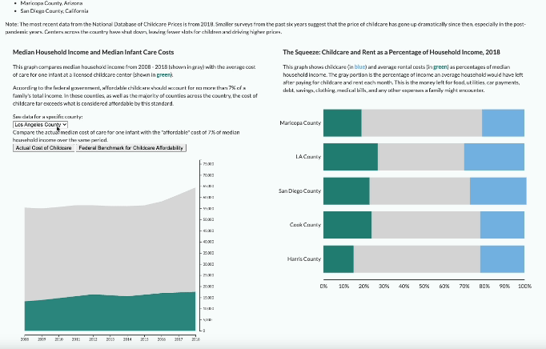

# Two Views of the Childcare Affordability Crisis in the Most Populous Counties in the United States

In the United States, the largest counties have the highest childcare costs. The visualizations in this project use data from the [Census Bureau's American Community survey](https://www.census.gov/programs-surveys/acs) and the [National Database of Childcare Prices](https://www.dol.gov/agencies/wb/topics/featured-childcare?_ga=2.142768381.913735267.1716344759-1093376893.1714408553) to examine the burden this places on American families.

You can view the project and learn more about the visualizations here:
https://eszypulski.github.io/childcare-burden/

Here's a preview of the visualizations, including interactivity that lets you view by county and compare the actual costs of childcare with what the U.S. government considers "affordable." (Spoiler: median childcare costs are way higher than the affordability benchmark.)

## Data Sources

-   Income, population, rent costs: [Census Bureau's American Community survey](https://www.census.gov/programs-surveys/acs)
    
-   Median infant care costs: [National Database of Childcare Prices](https://www.dol.gov/agencies/wb/topics/featured-childcare?_ga=2.142768381.913735267.1716344759-1093376893.1714408553)
  and [data explainer](https://www.dol.gov/sites/dolgov/files/WB/media/NationalDatabaseofChildcarePricesTechnicalGuideFinal.pdf).

## Code Resources I Consulted
-   [https://d3js.org/d3-shape/area](https://d3js.org/d3-shape/area)
    
-   [https://d3-graph-gallery.com/interactivity.html](https://d3-graph-gallery.com/interactivity.html)
    
-   [https://dataviz.unhcr.org/tools/d3/d3_stacked_column_100perc_chart.html](https://dataviz.unhcr.org/tools/d3/d3_stacked_column_100perc_chart.html)
    
-   [https://d3-graph-gallery.com/graph/barplot_stacked_basicWide.html](https://d3-graph-gallery.com/graph/barplot_stacked_basicWide.html)
    
-   [https://observablehq.com/@d3/stacked-bar-chart/2](https://observablehq.com/@d3/stacked-bar-chart/2)
    
-   [https://stackoverflow.com/questions/70490586/d3-stacked-bar-chart-with-3-columns-of-data](https://stackoverflow.com/questions/70490586/d3-stacked-bar-chart-with-3-columns-of-data)
    
-   [https://www.youtube.com/watch?v=byJJRWz7sG0](https://www.youtube.com/watch?v=byJJRWz7sG0)